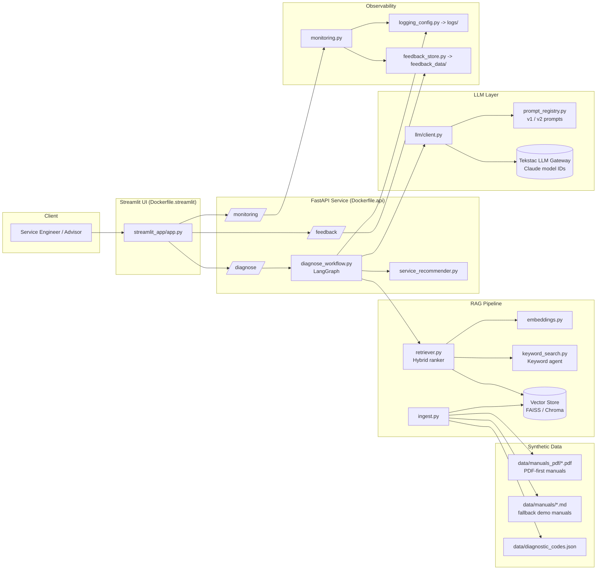
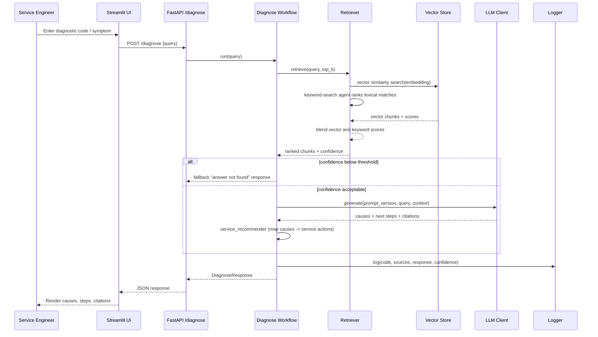
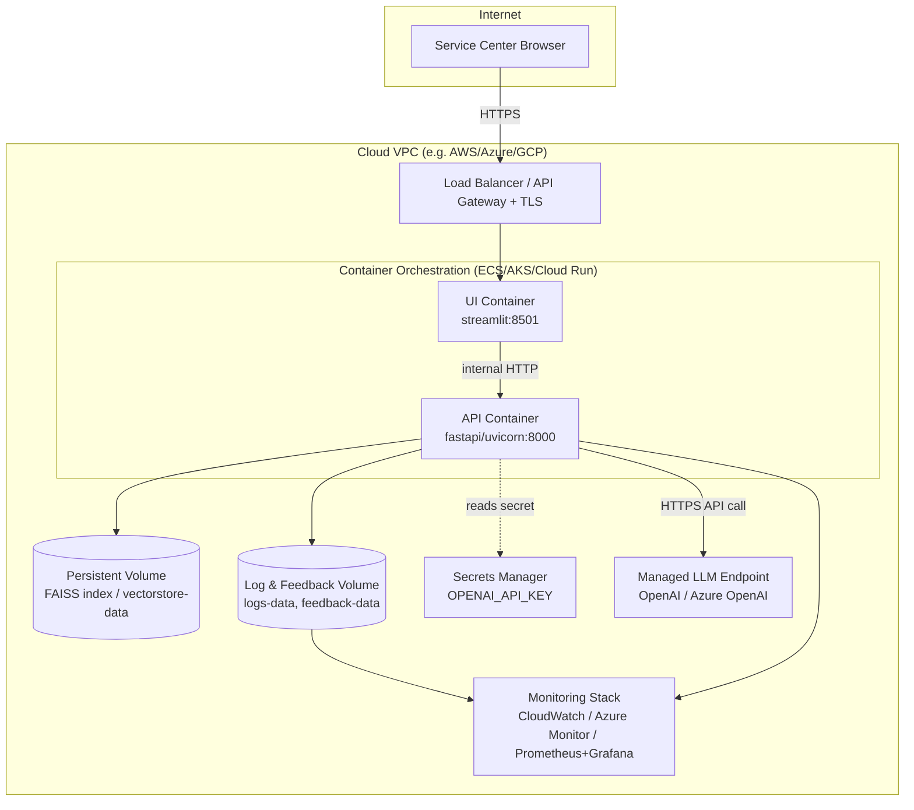

# Architecture & Deployment — Automotive GenAI Diagnostics Assistant

## 1. High-Level Component Architecture

## 2. Request Flow (Diagnose)

## 3. Deployment Diagram

Local development mirrors this exactly via `docker-compose.yml`: the `api` and `ui`
services correspond to the two containers, named Docker volumes
(`vectorstore-data`, `logs-data`, `feedback-data`) stand in for the persistent
volume, and environment variables (`OPENAI_API_KEY`, `VECTOR_DB_BACKEND`, etc.)
stand in for the secrets manager / config map.

## 4. Managed LLM Endpoint Design

- **Provider abstraction**: [app/llm/client.py](../app/llm/client.py) wraps calls behind a single
  `LLMClient.generate()` interface. In production this targets a managed
  endpoint (`https://llmgw-wp.tekstac.com`) with configured Claude gateway model ids;
  locally, when
  `OPENAI_API_KEY` is unset, it transparently falls back to a deterministic
  mock generator so the demo and tests run offline.
- **Prompt version control**: prompts are versioned modules
  (`app/llm/prompts/v1.py`, `v2.py`) selected via `PROMPT_VERSION` env var and
  tracked in [PROMPT_CHANGELOG.md](../PROMPT_CHANGELOG.md), enabling safe rollout/rollback
  without code changes.
- **Resilience**: request timeouts + retry/backoff at the client layer;
  on repeated failure the workflow returns the safety/fallback response
  instead of raising to the UI.
- **Isolation**: the LLM endpoint is never called directly by the UI — all
  calls are proxied through the FastAPI service so API keys stay server-side.

## 5. Security Notes

- Secrets (`OPENAI_API_KEY`) are injected via environment variables / secrets
  manager, never committed (`.env` is gitignored, `.env.example` provided).
- API container runs as non-root where supported by the base image; only
  ports 8000 (API) and 8501 (UI) are exposed.
- The UI never talks to the LLM endpoint directly — only to the FastAPI
  service — keeping the API key out of the browser-facing tier.
- Input validation via Pydantic schemas (`app/api/schemas.py`) on all
  endpoints.
